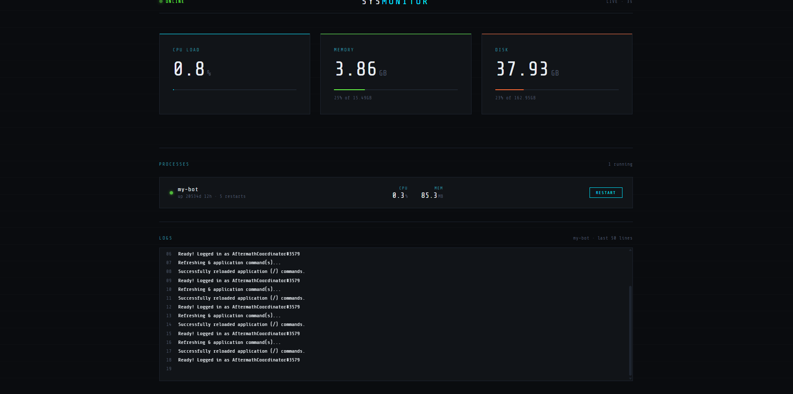

# SysMonitor

A self-hosted server dashboard for monitoring and managing a home mini PC from any browser on the same network. Built because I wanted a clean way to check on my machine and control my Discord bot without needing a monitor or SSH.



## Features

- **Live system stats** — CPU load, RAM usage, and disk usage updated every 3 seconds
- **Process management** — view all PM2 processes with uptime, restart count, CPU and memory per process
- **One-click restart** — restart any managed process directly from the browser
- **Live logs** — scrolling log window showing the last 50 lines of output from any process
- **Auto-start on boot** — backend runs as a PM2 process so the dashboard survives reboots

## Tech Stack

**Frontend**
- React + TypeScript
- Vite
- Plain CSS

**Backend**
- Node.js + Express + TypeScript
- [systeminformation](https://github.com/sebhildebrandt/systeminformation) — CPU, RAM, disk stats
- PM2 — process management and log access

## How It Works

The Express backend runs on the mini PC and exposes a small REST API. It reads system stats via `systeminformation` and talks to PM2 to list, control, and stream logs from running processes. The React frontend polls the API every 3 seconds and renders everything live.

Since it runs on a local network, you access it by pointing your browser at the mini PC's local IP — no deployment, no auth, no cloud.

```
http://192.168.x.x:3000
```

## Setup

### Prerequisites
- Node.js
- PM2 installed globally (`npm install -g pm2`)
- Your processes already running under PM2

### Backend

```bash
cd backend
npm install
npm run build
pm2 start dist/index.js --name dashboard
pm2 save
pm2 startup
```

Create a `.env` file in the backend root:

```
PORT=3000
```

### Frontend

```bash
cd frontend
npm install
npm run dev -- --host
```

Then open `http://[your-mini-pc-ip]:5173` on any device on the same network.

## Project Structure

```
pc-dashboard/
├── backend/
│   ├── src/
│   │   ├── index.ts
│   │   └── routes/
│   │       ├── stats.ts
│   │       ├── services.ts
│   │       └── logs.ts
│   └── package.json
└── frontend/
    ├── src/
    │   ├── App.tsx
    │   ├── pages/
    │   │   ├── Overview.tsx
    │   │   ├── Services.tsx
    │   │   └── Logs.tsx
    │   └── types/
    │       └── types.ts
    └── package.json
```